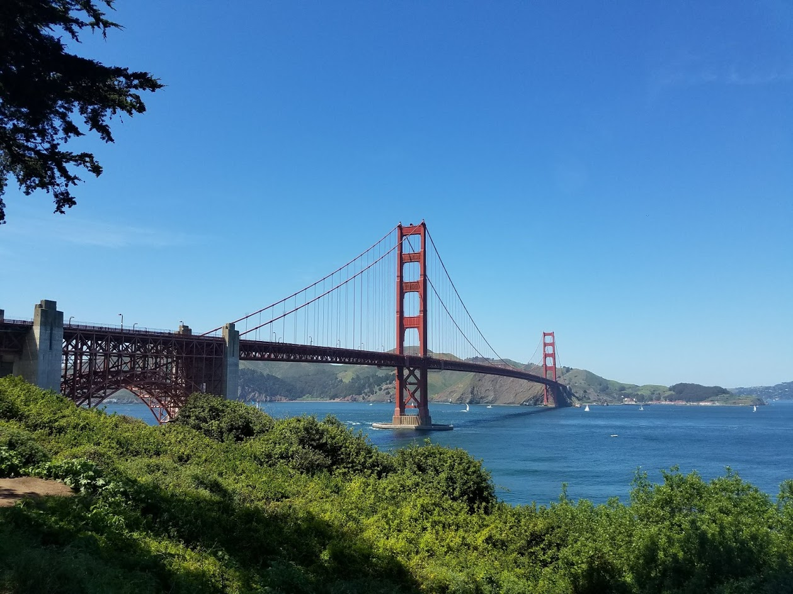
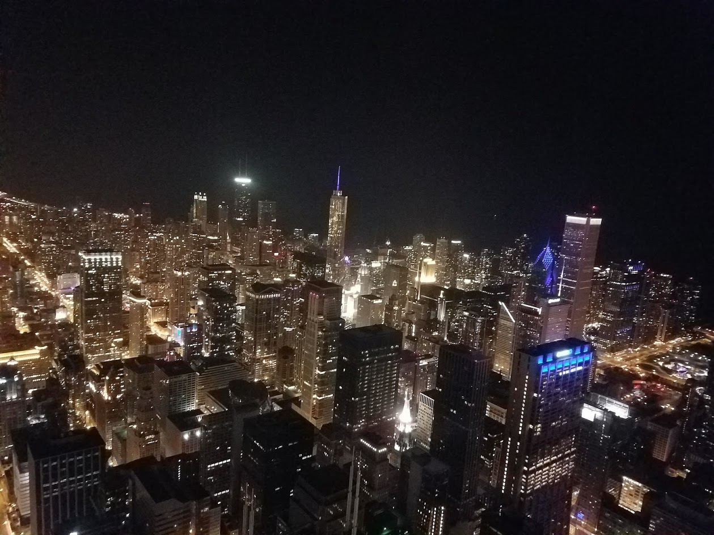

<html>
<head>
<meta charset="utf-8">
<title>Stewart's Travel Page</title>

</head>
<body>
<header>
SO <nav> nav links go here </nav>
  </header>

<h1>My Trips in the U.S.</h1>

<header>
  <ul>
   <li>Cities
     <ul>
       <li>
       
 
            <a href="#San_Francisco">San Francisco</a>
           <a href="#Chicago">Chicago</a>
           <a href="#Houston">Houston</a>
    

       </li>
            
     </ul>
    </li>
    
  
    
   <li>Hotel</li>
   <li>Restaurant</li>
   <li>Other Attractions</li>
        </ul>
</header>

<section>
<section id="San_Francisco">

<a href="https://en.wikipedia.org/wiki/San_Francisco" target="_blank" title="Linking to wikipedia page"><h3>San Francisco </h3></a>
<ul>

<li>
Hotel

  <ul>
    <li>The Marker Hotel</li>
    <li>Hotel Kabuki</li>
     </ul>
  </li>
  

<li>
Restaurant

            <ul>
          <li>The Noodle place</li>
          <li>Restaurant 2</li>
          <li>Restaurant 3</li>
        </ul>
      </li>

<li>
Other Attractions

        <ul>
  <li>Coit Tower</li>
          <li>Beach</li>
          <li>Swiggly road</li>
  <li>Bart - drinking beer</li>
  <li>Treasure Island place with bus</li>
  </ul>
  </li>
</ul>

</section>

 
     
   <section> 
<section id="Chicago">
<a href="https://en.wikipedia.org/wiki/Chicago" target="_blank" title="Linking to wikipedia page"><h3>Chicago </h3></a>
    &quot;The Windy City&quot; was always clouldy flying in. When the plane is landing and starts to break into the clouds, you usually hit turbulence. I like to look out the window but in Chicago, you can't see through the dense fog until a few seconds before you hit the runway.
        
  

<ul>
<li>
Hotel

  <ul>
    <li>The Talbot Hotel</li>
    <li>Embassy Suties</li>
    </li>
     </ul>
 

     <li>
Restaurant

            <ul>
          <li>Restaurant 1</li>
          <li>Restaurant 2</li>
          <li>Restaurant 3</li>
        </ul>
      </li>
      

  <li>
Other Attractions

  <ul>
          <li>Other Attractions 1</li>
          <li>Other Attractions 2</li>
          <li>Other Attractions 3</li>
        </ul>
  </li>
    </ul>

</section>

<section>
 <section id="Houston">
   <a href="https://en.wikipedia.org/wiki/Houston" target="_blank" title="Linking to wikipedia page">
    <h2> Houston </h2></a>

<ul>
  <li>
Hotel

  <ul>
    <li>Hotel Derek</li>
    <li>...</li>
     </ul>
  

      <li>
Restaurant

            <ul>
          <li>Restaurant 1</li>
          <li>Restaurant 2</li>
          <li>Restaurant 3</li>
        </ul>
      </li>
    

      <li>
Other Attractions

  <ul>
          <li>Other Attractions 1</li>
          <li>Other Attractions 2</li>
          <li>Other Attractions 3</li>
        </ul>
  </li>
    </ul>

</section>

<aside>
Related posts go here.
</aside>
  

</body>

    

      <a href="#top">Back to Top</a>
    

  

<footer>

Stewart's Travel Page Copyright &copy; 2021

</footer>

</html>
